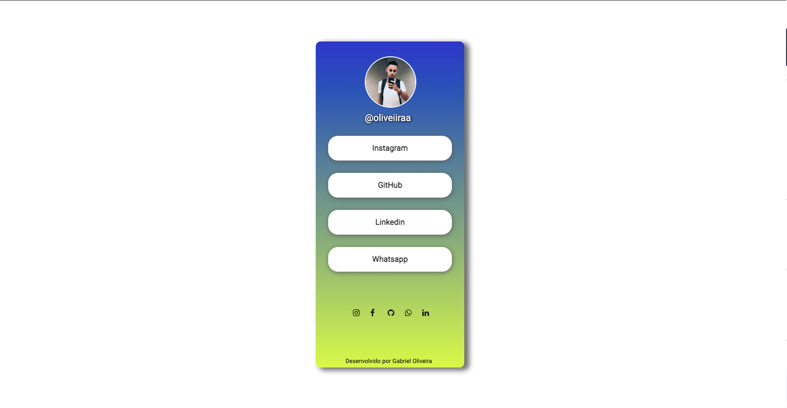

# UI Clone LinkTree

  
   

## Conteúdo

- [UI Clone LinkTree](#ui-clone-google)
  - [Conteúdo](#conteúdo)
  - [:bookmark: Sobre](#bookmark-sobre)
  - [:rocket: Tecnologias Utilizadas](#rocket-tecnologias-utilizadas)
  - [:recycle: Como contribuir](#recycle-como-contribuir)

## :bookmark: Sobre

Clone da página do LinkTree feito somente com css e html com intuito de praticar tricks do css.

## :rocket: Tecnologias Utilizadas

O projeto foi desenvolvido utilizando as seguintes tecnologias

- [HTML 5](https://www.html.com/)
- [CSS](https://www.w3.org/Style/CSS/)

## :recycle: Como contribuir

- Faça um Fork desse repositório,
- Crie uma branch com a sua feature: `git checkout -b my-feature`
- Commit suas mudanças: `git commit -m 'feat: My new feature'`
- Push a sua branch: `git push origin my-feature`

---

<h4 align=center>Made with 💙 by <a href="https://www.linkedin.com/in/gabriel-h-oliveira/">Gabriel Oliveira</a></h4>